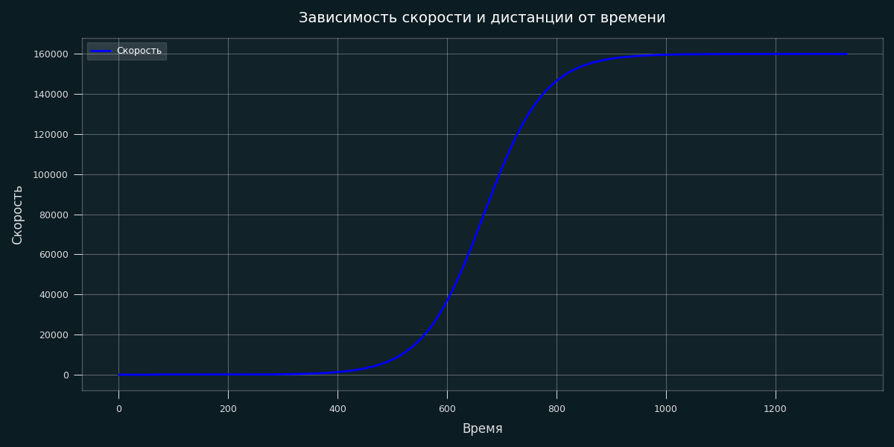

# Модуль управления шаговым двигателем

## Общее описание

Данный модуль представляет собой программную библиотеку для управления шаговым двигателем на микроконтроллерах STM32F4. Модуль реализует следующие функции:

- **Генерация импульсов** с помощью аппаратного таймера в режиме ШИМ
- **Плавное управление скоростью** на основе S-образного (сигмоидального) профиля
- **Абстрактный интерфейс планировщика** для поддержки различных алгоритмов разгона/торможения
- **Поддержка RTOS** с возможностью работы в многозадачной среде

### Структура модуля
```
├── App
├─── Inc
├──── step_motor.h
├─── Src
├──── step_motor.c
├── Driver
├─── Inc
├──── motor_driver.h
├──── motor_driver_def_stm32.h
├──── motor_driver_stm32.h
├─── Src
├──── motor_driver.c
├──── motor_driver_stm32.c
├── MotionMath
├─── Inc
├──── planner.h
├──── sigmoid.h
├─── Src
├──── planner.c
├──── sigmoid.c
```

### Сигмоидальный планировщик

В основе плавного управления скоростью лежит сигмоидальная функция:
```
v(t) = v0 + dv / (1 + exp(-k*(t - t0)))
```

Где:
- `v0` — начальная скорость (имп/с)
- `dv` — приращение скорости (конечная − начальная)
- `k` — коэффициент крутизны перехода
- `t0` — момент времени, соответствующий середине перехода



### Параметры примера на графике:
- Начальная скорость: **0 имп/с**
- Конечная скорость: **160 000 имп/с**
- Ускорение (макс.): **120 000 имп/с²**
- Время разгона: **~1330 мс**
- Минимальная рабочая скорость (v_jump): **125 имп/с**

### Особенности сигмоидального профиля:
1. **Плавный старт** — исключает резкие рывки при начале движения.
2. **Плавный выход на максимальную скорость** — снижает нагрузку на механику.
3. **Отсутствие рывков (jerk)** — производная ускорения непрерывна.
4. **Естественная S-образная форма** — оптимальна для большинства применений.
5. **Устранение низких скоростей** через параметр `v_jump`, что позволяет избежать пропусков шагов на малых частотах.

> ⚠️ **Важно:** Данная реализация не поддерживает переход через нулевую скорость (реверс) в рамках одного профиля. Для реверса необходимо остановить двигатель и запустить новый профиль с противоположным знаком скорости.

---

## Пример использования

Ниже приведён типовой пример настройки и запуска модуля в среде с RTOS.

```c
StepMotor_t motor = {0};

int main(void) {
    ...

    // Настройка таймера для генерации импульсов
    motor.dr.htim.Instance = TIM2;
    motor.dr.htim.Channel = TIM_CHAN_2;
    motor.dr.htim.Bit = TIM_32_BIT;          // 32-битный таймер
    motor.dr.htim.Clock = 100000000;         // Частота тактирования таймера (Гц)
    motor.dr.htim.IRQn = TIM2_IRQn;

    // Настройка пина направления
    motor.dr.dir.Port = DIR_GPIO_Port;
    motor.dr.dir.Pin  = DIR_Pin;

    // Настройка пина включения (Enable)
    motor.dr.en.Port = EN_GPIO_Port;
    motor.dr.en.Pin  = EN_Pin;

    // Функция получения системного времени (для расчётов задержек)
    motor.dr.GetTick = HAL_GetTick;

    // Параметры сигмоидального профиля
    motor.pl.v_jump = 125;     // Минимальная стартовая скорость
    motor.pl.k_jump = 8.0f;    // Крутизна S-образной кривой

    // Включение тактирования таймера
    __HAL_RCC_TIM2_CLK_ENABLE();

    // Инициализация модуля
    StepMotor_Itf.Init(&motor);

    // Настройка приоритета прерывания таймера (высокий приоритет!)
    HAL_NVIC_SetPriority(TIM2_IRQn, 0, 0);
    HAL_NVIC_EnableIRQ(TIM2_IRQn);

    // Установка ускорения и включение двигателя
    StepMotor_Itf.SetAcc(&motor, 3600);   // имп/с²
    StepMotor_Itf.Enable(&motor);

    // Запуск RTOS
    osKernelInitialize();

    // Создание задач
    MotorTaskHandle = osThreadNew(StartMotorTask, NULL, &MotorTask_attributes);
    TreadmillTaskHandle = osThreadNew(StartTreadmillTask, NULL, &defaultTask_attributes);

    osKernelStart();
}

/**
  * @brief Обработчик прерывания таймера TIM2
  * 
  * Вызывается аппаратно при каждом обновлении таймера (сравнении/переполнении).
  * Генерирует импульсы для шагового двигателя.
  * 
  * @note Важно: Этот обработчик должен иметь наивысший приоритет
  * для обеспечения точной генерации импульсов. Внутри не должно быть
  * длительных операций или вызовов RTOS-функций, блокирующих прерывания.
  */
void TIM2_IRQHandler(void) {
    StepMotor_Itf.TIMx_IRQHandler(&motor);
}

/**
  * @brief Задача планировщика двигателя
  * 
  * Периодически обновляет целевую скорость в соответствии с сигмоидальным профилем.
  * Выполняется с низким приоритетом, так как точность генерации импульсов
  * обеспечивается аппаратным таймером.
  * 
  * @param argument Не используется
  */
void StartMotorTask(void *argument) {
    while (true) {
        StepMotor_Itf.TaskPlanner(&motor);
        osDelay(1);
    }
}

/**
  * @brief Задача управления скоростью (демонстрационная)
  * 
  * Циклически изменяет целевую скорость двигателя для демонстрации
  * разгона, торможения и смены направления.
  * 
  * @param argument Не используется
  * 
  * @note В реальных приложениях здесь может быть реализована логика
  * управления от внешних датчиков, ПИД-регулятора или команд по интерфейсу.
  */
void StartTreadmillTask(void *argument) {
    int32_t vel = 4000;   // начальная скорость (имп/с)

    while (true) {
        StepMotor_Itf.SetVel(&motor, vel);

        // Ждём достижения скорости, затем меняем направление
        if (StepMotor_Itf.GetVel(&motor) == vel) {
            vel = -vel;   // реверс
        }

        osDelay(1);
    }
}
```